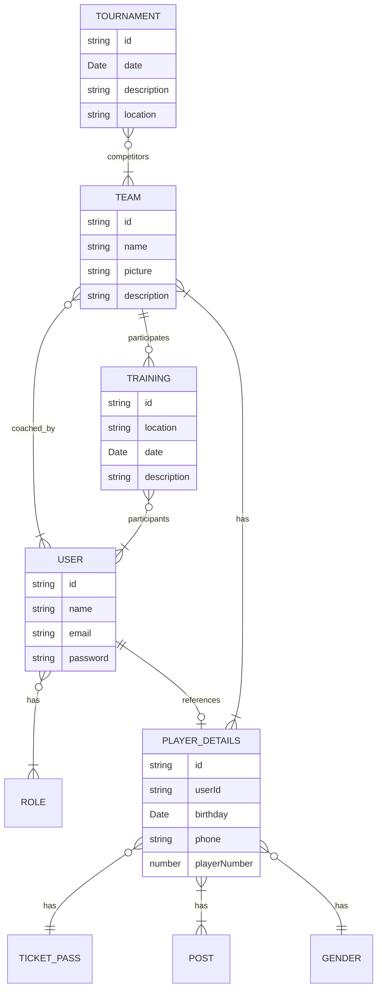

## Description
--o| nullable field \
--|| not nullable field \
--o{ list \
--|{ list \
}o--o{ linking table \
}|--o{ linking table

Use-cases:
- User:
    - can register 
    - can add own player details
    - nice-to-have: 
        - feedback for training
        - can request to join a team
        - respond to training
- Coach:
    - can add team member
    - can add trainings
- Administrator:
    - can create new team
    - can create new tournament
    - can assign coach to team
    - can promote a user to a coach
    - temporary
        - can add team member
        - can add trainings
        - can add details for a player

