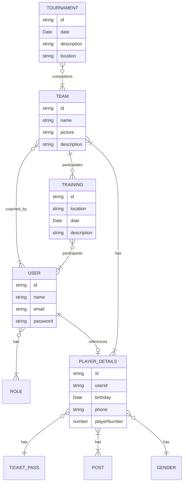

```mermaid
    erDiagram
    ROLE { }
    GENDER { }
    POST { }
    TICKET_PASS { }
    USER {
        string id
        string name
        string email
        string password
    }
    PLAYER_DETAILS {
        string id
        string userId
        Date birthday
        string phone
        number playerNumber
    } 
    TEAM {
        string id
        string name
        string picture
        string description
    }
    TRAINING {
        string id
        string location
        Date date
        string description
    }
    TOURNAMENT {
        string id
        Date date
        string description 
        string location
    }
    USER ||--o| PLAYER_DETAILS : references
    TEAM }|--|{ PLAYER_DETAILS : has
    TEAM ||--o{ TRAINING : participates
    USER }o--|{ ROLE: has
    PLAYER_DETAILS }o--|| TICKET_PASS: has
    PLAYER_DETAILS }|--|{ POST: has
    PLAYER_DETAILS }o--|| GENDER: has
    TEAM }o--|{ USER : coached_by
    TRAINING }o--|{ USER : participants
    TOURNAMENT }o--|{ TEAM : competitors
```

## Description
--o| nullable field \
--|| not nullable field \
--o{ list \
--|{ list \
}o--o{ linking table \
}|--o{ linking table